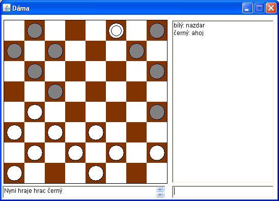

# dama
Klasická hra Dáma. Lze hrát buď proti počítači nebo ve dvou přes síť. Lze nastavit velikost desky i pravidla. 

## Jak spustit
Ke spuštění je třeba mít nainstalovanou Javu.
Javu získáte třeba zde: https://www.java.com/download/

Pokud javu máte, stačí poklepat na dama.jar a hra se spustí.

## Změny ve verzích
Seznam změn je v souboru [CHANGELOG.md](CHANGELOG.md)

## Licence
Hra je vydána pod licencí GNU/GPL verze 3.
Licenci si lze přečíst (anglicky) v souboru [LICENSE](LICENSE)

## Autor
Jindra Petřík aka JPEXS

